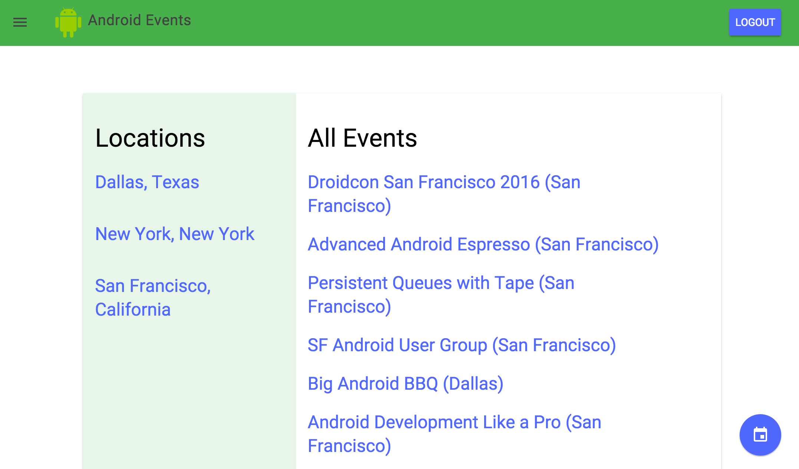
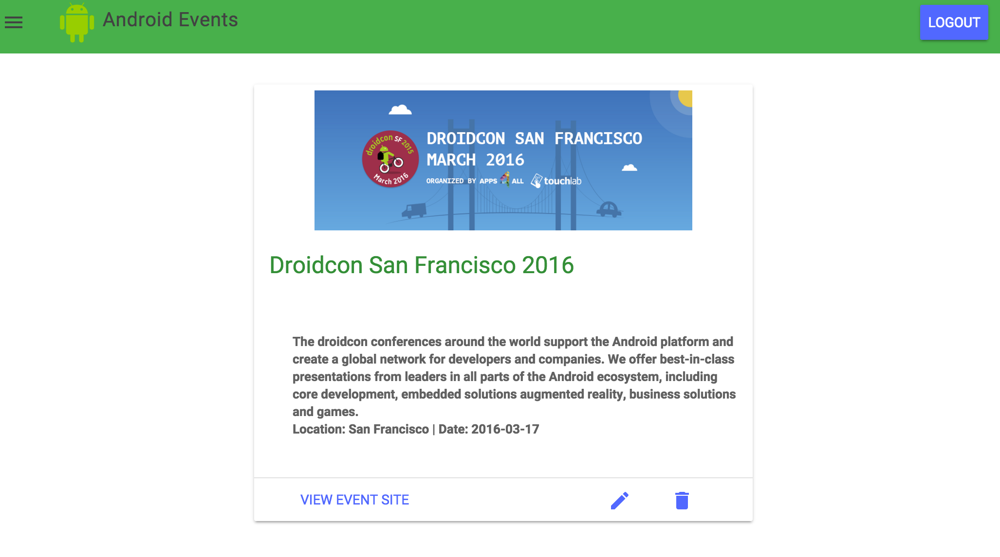
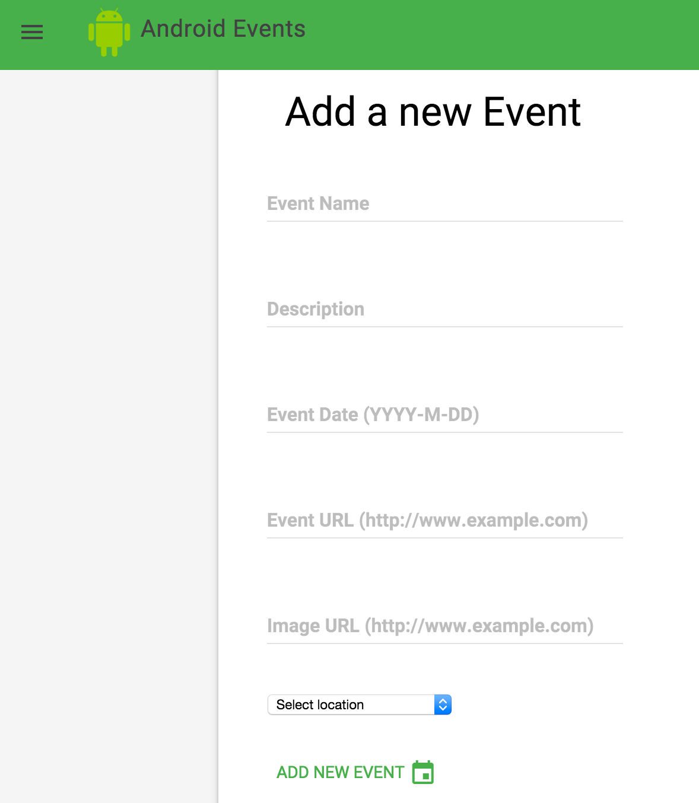
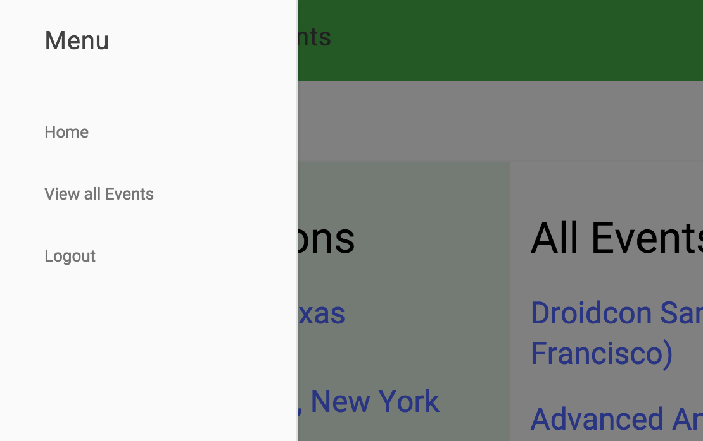

# Android Events Catalog

## Introduction
This project is an example of an Item Catalog for Project 3 for the Udacity FSND. It lists cities and events in each city. This project is developed using Python 2.7. It is based on the OAuth sample from Udacity https://github.com/udacity/OAuth2.0

## Requirements
Flask == 0.9<br>
SQLAlchemy == 1.0.7<br>
SeaSurf == 0.1.21<br>
For easy installation, run pip install -r requirements.txt. Note, you may need to run this as root using sudo.

## Set-up
The data is stored in a sqlite database. To create the database, from the terminal run: 
```
python database_setup.py  
```
<br>
To load the database, from the terminal run: 
```
python lotsofevents-users.py  
```
<br>
## Run the app
To launch the application, from the terminal run:
```
python project.py
```

## Usage
The website can be viewed at: localhost:8000. New events can be added, edited, and deleted by logged in users. Data is also accessible via a JSON [1] and XML [2] endpoints.
<br>
[1] http://localhost:8000/all-events/JSON
<br>
[2] http://localhost:8000/all-events/XML

# Screenshots
Home page <br>


<br><br>
 
Event Details <br>


<br><br>

Add New Event<br>


<br><br>

Navigation Drawer<br>

